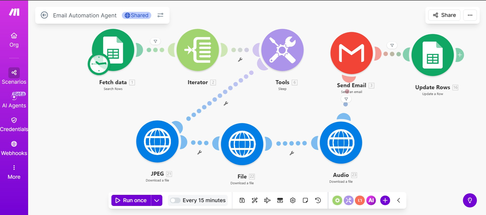
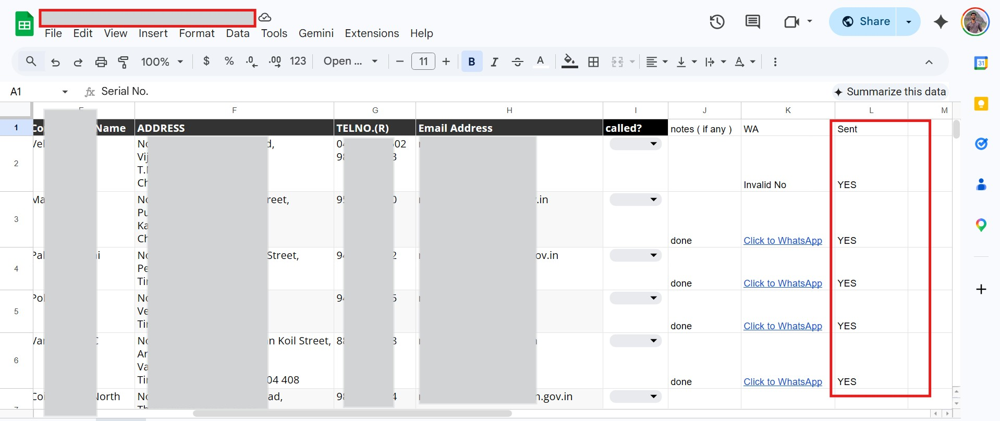
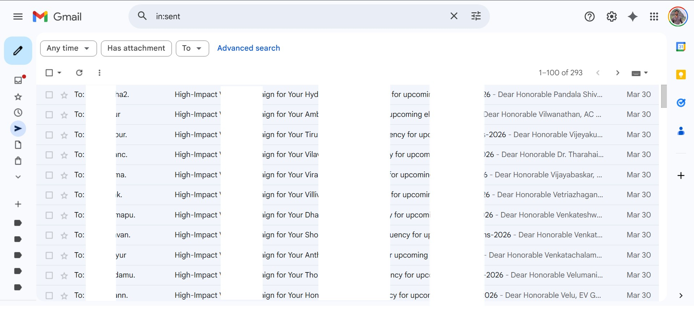

# 📧 Automated Client Email Outreach — Make.com

> Built for a client who wanted to reach their leads at scale — zero manual effort, zero duplicate sends.


---

## 🎯 What This Does

A fully automated end-to-end email outreach system built on **Make.com** for a client who needed to reach their leads at scale. The system reads lead data from Google Sheets, filters invalid or already-contacted leads, downloads media attachments from Google Drive, and sends personalized HTML emails — then auto-marks each row as sent.

**Resumes exactly where it left off, even if interrupted mid-run.**

---

## 🧠 How Leads Were Sourced — Apify + Claude (MCP)

Before the outreach automation runs, leads are scraped from open sources using a powerful AI-driven pipeline:

```
Claude AI (MCP) ──connects──▶ Apify ──scrapes──▶ Open Sources
                                    │
                                    ▼
                          Structured Lead Data
                                    │
                                    ▼
                           Google Sheets (CRM)
```

- **Claude AI** is connected to **Apify** via **MCP (Model Context Protocol)** — allowing Claude to directly trigger Apify actors and retrieve scraped data through natural language instructions
- **Apify** scrapes lead details (names, emails, company info) from open/public sources
- Scraped data is structured and pushed directly into the **Google Sheet** that feeds the automation
- This eliminates manual lead research entirely — from discovery to outreach, the entire pipeline is automated

---

## ⚙️ Automation Flow

```
Google Sheets (Lead Data)
        │
        ▼
  Iterator (Row by Row)
        │
        ▼
  Filter: Skip empty emails
        │
        ▼
  Filter: Skip already-sent (Email Sent = YES)
        │
        ▼
  HTTP Module: Download media from Google Drive
  (converted from preview URL → direct download URL)
        │
        ▼
  Gmail: Send personalized HTML email
  (with image + audio & other attachments)
        │
        ▼
  Google Sheets: Mark row Email Sent = YES
```

---

## 🔧 Built With

| Tool | Purpose |
|------|---------|
| **Make.com** | Core automation platform |
| **Google Sheets** | Lead database & sent tracking |
| **Gmail Module** | Sending personalized HTML emails |
| **Google Drive + HTTP Module** | Downloading & attaching media files |
| **Iterator** | Processing each lead row one by one |
| **Apify** | Scraping lead data from open sources |
| **Claude AI (MCP)** | Connecting to Apify via Model Context Protocol to trigger scraping via natural language |

---

## 📸 Workflow Screenshots

### Make.com Scenario — Full Workflow


---

### Google Sheets — Lead Data & Email Sent Column


---

### Gmail Sent Box — Emails Delivered


---

## ✨ Key Features

- ✅ **Zero duplicate sends** — `Email Sent` column filter prevents re-sending to already contacted leads
- ✅ **Handles interruptions** — resumes exactly where it left off if the run is stopped mid-way
- ✅ **Media attachments** — sends personalized emails with image + audio & other files attached
- ✅ **Google Drive integration** — converts preview URLs to direct download URLs for reliable attachment delivery
- ✅ **Invalid lead filtering** — skips rows with empty or invalid email fields automatically
- ✅ **HTML emails** — rich, branded email format (not plain text)
- ✅ **Fully no-code** — built entirely on Make.com, no backend server needed
- ✅ **AI-powered lead sourcing** — Claude + Apify MCP pipeline for automated lead discovery

---

## 🐛 Challenges Solved

| Problem | Solution |
|---------|----------|
| `BundleValidationError` on empty email rows | Added filter module before Gmail to skip empty email fields |
| Attachments not delivering | Fixed Google Drive preview URLs → converted to direct download format `/uc?export=download&id=FILE_ID` |
| Duplicate emails being sent on re-run | Added `Email Sent` column + filter + Google Sheets update module |
| Leads had to be manually researched | Integrated Claude AI + Apify via MCP to auto-scrape leads from open sources |

---

## 💼 Use Cases

- 📈 Sales lead generation outreach
- 🤝 Client onboarding communication
- 📣 Product & service promotion campaigns
- 🔁 Follow-up email automation
- 📦 Any bulk personalized email workflow with attachments

---

## 🚀 Future Improvements Planned

- [ ] CRM integration (HubSpot/Notion) to sync lead status in real time
- [ ] WhatsApp outreach module running alongside email
- [ ] AI-personalized email body per lead using Claude/GPT
- [ ] Auto-reply detection & follow-up trigger
- [ ] Dashboard to track open rates & sent counts in real time

---

## 📣 Client Context

> This automation was built on a **client's request**. They needed a scalable way to reach their leads without manual effort. The full pipeline — from lead scraping (Apify + Claude MCP) to personalized email delivery (Make.com) — was designed and deployed end-to-end.
>
> All lead data, email addresses, and client information shown in screenshots has been **blurred/redacted** to maintain confidentiality.

---

## 🔗 Live Demo, Post & .json

- 📝 **LinkedIn Post** — [View the full breakdown on LinkedIn](https://www.linkedin.com/posts/shiva-pandala_makedotcom-automation-nocode-activity-7444633978801651712-l8z-?utm_source=share&utm_medium=member_desktop&rcm=ACoAADlEKVMBs6oNyCBicDe1KNIl3bVZiaCEKQM)
- 💻 **Live Link ** — [Scenario on make.com](https://eu1.make.com/public/shared-scenario/6sY2FsH5hGj/automated-client-email-campaign-media)
- 📝 **Email Automation Agent.blueprint** -- [.json file to import](refer .json file in the main branch to import directly on make.com, you just need to signin with your credentials where ever required.)

---

## 👤 Author

**Pandala Shiva**
- 🌐 [Portfolio](https://ShivaNetha1.github.io)
- 💼 [LinkedIn](https://linkedin.com/in/shiva-pandala)
- 🐙 [GitHub](https://github.com/ShivaNetha1)
- 📧 pandalashivanetha@gmail.com

---

> *"Never ask a builder about his token usage. He's been through enough."* 🥲
